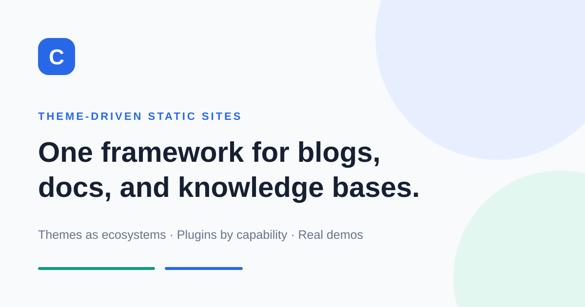

# Cogita

**A theme-driven static site framework for blogs, docs, editorial publishing, and knowledge bases.**

Cogita helps you turn a content repository into a site with a clear reading experience. Choose the shape of the site first, add capabilities through plugins, and keep your Markdown, JSON, or Git-backed content in the repository you control.

[Explore the live demos](https://wu9o.github.io/cogita/demos/) · [Read the handbook](https://wu9o.github.io/cogita/) · [中文文档](https://wu9o.github.io/cogita/zh-CN/)

[](https://badge.fury.io/js/@cogita/core)
[](https://github.com/wu9o/cogita/actions/workflows/ci.yml)
[](https://github.com/wu9o/cogita/blob/main/LICENSE)



## Why Cogita

Many static sites begin as a theme, a collection of plugins, and a growing set of project-specific conventions. That works until the site becomes a handbook, a long-running publication, or a knowledge base with more than one content source.

Cogita makes the site shape explicit:

- **Themes define the experience.** A theme owns layouts, navigation, visual language, and its default capability set.
- **Plugins add capabilities.** Search, RSS, SEO, topics, collections, comments, content sources, and other features remain composable.
- **The site owns its content.** Write Markdown, connect JSON or Git sources, and keep content independent from framework packages.
- **The build stays static.** Cogita turns configuration and content into a deployable static site built on Rspress, React, and TypeScript.

The result is a framework that can start as a personal blog and grow into documentation or a connected knowledge space without replacing the underlying project.

## See it in action

The repository includes four independent demos with their own configuration and sample content. Start with the [theme showcase](https://wu9o.github.io/cogita/demos/) and choose the site shape closest to your project:

| Site shape | Best for | Try it |
| --- | --- | --- |
| **Knowledge** | Connected research notes, mixed repositories, and backlinks | [Open the Knowledge demo](https://wu9o.github.io/cogita/demos/knowledge/) |
| **Docs** | Handbooks, API references, and focused navigation | [Open the Docs demo](https://wu9o.github.io/cogita/demos/docs/) |
| **Lucid** | Personal blogs, notes, topics, and archives | [Open the Lucid demo](https://wu9o.github.io/cogita/demos/lucid/) |
| **Editorial** | Feature writing, series, and curated stories | [Open the Editorial demo](https://wu9o.github.io/cogita/demos/editorial/) |

Each demo is a real site consumer in this repository, not a screenshot-only showcase. You can inspect its configuration, content, and theme integration, then build all four locally with `pnpm run demo`.

### A visual tour

These previews are generated from the same theme consumers that ship in the repository. They show the difference in reading rhythm more clearly than a package list can:

<table>
  <tr>
    <td width="33%"><a href="https://wu9o.github.io/cogita/demos/docs/"></a></td>
    <td width="33%"><a href="https://wu9o.github.io/cogita/demos/lucid/"></a></td>
    <td width="33%"><a href="https://wu9o.github.io/cogita/demos/editorial/"></a></td>
  </tr>
  <tr>
    <td align="center"><strong>Docs</strong><br />Reference and navigation</td>
    <td align="center"><strong>Lucid</strong><br />Notes and publishing flow</td>
    <td align="center"><strong>Editorial</strong><br />Feature-led reading</td>
  </tr>
</table>

For the Knowledge direction, see the [live Knowledge demo](https://wu9o.github.io/cogita/demos/knowledge/) and its [content-source diagram](./demos/knowledge/git-content/assets/content-source.svg), which shows how Git content enters the shared index and reaches the theme.

## The mental model

```text
your config + your content
              ↓
            Cogita
       ↙       ↓       ↘
   theme    plugins    content sources
              ↓
       static site output
```

Themes declare the experience they provide. Plugins declare the capabilities they need. Core connects those contracts and preserves access to the underlying Rspress configuration when a site needs more control.

## Start in five minutes

The fastest path is an official starter:

```bash
pnpm dlx @cogita/cli create my-site --template knowledge
cd my-site
pnpm dev
```

Available templates include `blog`, `docs`, `knowledge`, and `knowledge-external`. Use `knowledge-external` when JSON or Git content sources should join the site.

For a custom site, install Core, the CLI, and an official theme:

```bash
pnpm add -D @cogita/cli @cogita/core @cogita/theme-lucid
```

```ts
import { defineConfig } from '@cogita/core';

export default defineConfig({
  site: {
    title: 'My Site',
    description: 'A site built with Cogita.',
    url: 'https://example.com',
  },
  posts: { dir: 'posts' },
  theme: '@cogita/theme-lucid',
});
```

Then run `pnpm exec cogita dev` and start writing under `posts/` or `content/`.

## Official themes and extensions

Official themes are complete starting points rather than visual skins:

- [`@cogita/theme-docs`](./themes/docs) — structured navigation and reference reading.
- [`@cogita/theme-lucid`](./themes/lucid) — lightweight publishing, topics, and archives.
- [`@cogita/theme-editorial`](./themes/editorial) — feature-led layouts and series.
- [`@cogita/theme-knowledge`](./themes/knowledge) — unified content, search, relations, and mixed sources.

The plugin library covers posts, RSS, topics, categories, collections, search, SEO, sitemaps, images, reading progress, code copying, comments, content checks, i18n, JSON sources, and Git sources. See the [package and capability map](./docs-site/content/package-map.md) for the current boundaries.

The extension path is deliberately small:

```text
site config → Core → theme → plugins → static output
```

Themes own page composition, plugins own capabilities and configuration namespaces, and site-specific rules stay in the site repository.

## Documentation

- [Online handbook](https://wu9o.github.io/cogita/)
- [Getting started](./docs-site/content/getting-started.md)
- [Theme overview](./docs-site/content/themes.md)
- [Best practices](./docs-site/content/guides/best-practices.md)
- [Deployment guide](./docs-site/content/guides/deployment.md)
- [Plugin development](./docs-site/content/plugins/plugin-development.md)
- [API reference](./docs-site/content/api/api-reference.md)
- [Architecture design](./docs-site/content/api/architecture-design.md)
- [Roadmap](./ROADMAP.md)

The handbook includes an `English / 中文` route switcher. UI copy can be localized with [`@cogita/plugin-i18n`](./plugins/i18n) while article content remains in the language chosen by the site owner.

## Develop Cogita locally

Requirements: Node.js 18 or newer and pnpm 9 or newer.

```bash
pnpm install
pnpm run build:packages
pnpm run test
pnpm run check
```

Useful workflows:

```bash
pnpm run dev          # develop the documentation site
pnpm run demo         # build and preview all official theme demos
pnpm run check:release
```

See [CONTRIBUTING.md](./CONTRIBUTING.md) for package development, theme and plugin conventions, testing, and pull request guidance. Published package changes should include a Changeset.

## Project status

Cogita is ready for public evaluation. The core architecture, official themes, plugin library, CLI templates, independent demos, documentation, and adoption checks are in place. The next improvements are guided by real usage: making the first-run path clearer, improving starters and examples, and prioritizing community-requested themes or plugins.

If you try Cogita, feedback about the site shape, content source, or first confusing step is especially useful.

## Contributing and community

Issues, ideas, documentation improvements, new themes, plugins, and real-world demos are welcome:

- [Open an issue](https://github.com/wu9o/cogita/issues)
- [Start a discussion](https://github.com/wu9o/cogita/discussions)
- [Read the contributing guide](./CONTRIBUTING.md)

MIT © [wu9o](https://github.com/wu9o)
