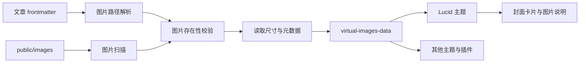

# 图片插件架构设计与实现规划

**文档版本**: 1.1
**创建日期**: 2026年8月21日
**插件名称**: `@cogita/plugin-images`
**状态**: 🚧 第一阶段已完成，第二阶段 B 开发中
**依赖**: `@cogita/plugin-posts-frontmatter`、`@cogita/ui`（主题集成阶段）

## 一、背景与目标

当前 Cogita 的示例博客以文字和代码块为主，文章可以引用图片，但仓库没有统一的图片资源约定、图片元数据模型或主题展示能力。现有最佳实践文档虽然给出了 Markdown 图片语法示例，却没有提供以下能力：

- 统一管理站点图片和文章局部图片；
- 从文章 frontmatter 读取封面图并传递给主题；
- 检查图片路径是否存在，减少部署后出现失效图片；
- 为主题提供尺寸、替代文本、说明文字等图片元数据；
- 在站点使用 `base` 或 `assetPrefix` 时正确生成图片 URL；
- 在不配置图片功能时不破坏现有的零配置体验。

本插件第一阶段的目标是建立“图片资源与元数据层”，让主题和文章可以稳定地使用图片。图片压缩、格式转换和响应式图片属于后续性能优化，不在第一阶段强行加入。

## 二、插件定位

插件命名为 `@cogita/plugin-images`，而不是直接命名为 `@cogita/plugin-image-optimization`。

两者解决的问题不同：

| 插件 | 主要职责 | 规划阶段 |
| --- | --- | --- |
| `@cogita/plugin-images` | 图片资源发现、路径解析、元数据、封面和主题展示 | 当前优先实现 |
| `@cogita/plugin-image-optimization` | 压缩、WebP/AVIF、响应式尺寸、缓存和性能策略 | 后续阶段 |

这样可以先解决“文章有图片且能正确显示”的基础问题，同时不把原生图片处理库、构建耗时和部署复杂度带入第一个版本。

## 三、设计原则

1. **尊重 Rspress 的资源处理能力**：第一阶段不重写 Markdown 图片语法。当前项目使用的 Rspress 构建链不会把 `public` 目录自动复制到静态输出，因此插件只在生产构建的 `afterBuild` 阶段复制已扫描的公共图片目录；正文局部图片仍由 Rspress 处理。
2. **插件负责数据，主题负责展示**：插件扫描和验证图片，主题和 UI 组件决定封面、图片卡片和图片说明的视觉形式。
3. **资源边界清晰**：正文相对图片交给 Rspress 资源管线，主题封面和运行时图片统一使用 `public/images` 或外部 URL。
4. **配置可选，基础行为稳定**：没有 `images` 配置时，插件应产生空数据而不是让主题导入虚拟模块失败。
5. **可访问性优先**：图片应支持 `alt`；缺失时可以使用 frontmatter 标题或文件名作为降级值，并在严格模式下给出警告或错误。
6. **URL 与文件路径分离**：内部使用绝对文件路径解析资源，暴露给浏览器时统一生成带 `base` 的 URL。

## 四、第一阶段范围

### 4.1 支持的图片来源

第一阶段只把 `public/images` 作为主题封面和运行时图片数据的来源：

```text
blog/
├── public/
│   └── images/              # 站点公共图片，URL 形如 /images/xxx.png
└── posts/
    └── article-slug/
        ├── index.md         # 文章
        └── assets/           # 正文局部图片，由 Rspress 原生处理
```

正文中的相对图片，例如 `./assets/diagram.png`，直接交给 Rspress 的 Markdown/MDX 资源管线处理。对于主题首页、文章列表这类运行时 React 组件使用的封面，第一阶段统一放入 `public/images`，避免插件自行猜测 Rspress 对局部资源生成的最终 URL。

这是一个有意的边界：Rspress 会把 Markdown 中的相对图片转换为资源导入；当前构建链不会自动复制 `public` 图片，因此插件在生产构建的 `afterBuild` 阶段补齐已扫描的公共图片目录。插件在 `beforeBuild` 阶段无法可靠知道局部资源最终是否会被哈希、改名或放入 `static` 目录。相关行为以 [Rspress 静态资源文档](https://www.rspress.dev/guide/basic/static-assets) 为准。

默认支持的扩展名：`.png`、`.jpg`、`.jpeg`、`.gif`、`.webp`、`.avif`、`.svg`。

### 4.2 Frontmatter 图片字段

第一阶段支持一个文章封面字段。封面推荐使用 `public` 逻辑路径或外部 URL：

```yaml
---
title: "文章标题"
image: "/images/cover.png"
imageAlt: "文章封面描述"
imageCaption: "文章封面说明"
---
```

字段约定：

| 字段 | 类型 | 说明 |
| --- | --- | --- |
| `image` | `string` | 封面图片路径，第一阶段支持 `public` 逻辑路径或外部 URL |
| `imageAlt` | `string` | 封面替代文本 |
| `imageCaption` | `string` | 封面说明文字 |

正文插图仍然使用标准 Markdown，局部图片不需要通过 `image` 字段声明：

```markdown

```

第一阶段不要求插件接管正文 Markdown 图片。Rspress 已提供 `markdown.image.checkDeadImages`，可以负责相对路径和 `public` 路径的死图检查；图片插件只负责 frontmatter 封面解析、公共图片元数据和主题数据。

### 4.3 图片元数据

构建阶段的数据和浏览器运行时的数据必须分离。绝对文件路径只能留在构建进程内，不能写入虚拟模块，否则会把开发机目录泄露到生成的 JavaScript 中。

构建阶段使用内部类型：

```typescript
interface ResolvedImage {
  filePath: string;
  relativePath: string;
  logicalSrc: string;
  name: string;
  extension: string;
  width?: number;
  height?: number;
  alt?: string;
  caption?: string;
  postRoute?: string;
}
```

向主题暴露的运行时数据使用不包含本地路径的类型：

```typescript
export interface ImageData {
  /** 站点逻辑路径或外部 URL，不包含本机绝对路径 */
  src: string;
  /** 图片相对于项目根目录的路径；外部 URL 没有此字段 */
  relativePath?: string;
  /** 原始文件名；外部 URL 可能没有此字段 */
  name?: string;
  /** 文件扩展名；外部 URL 可能没有此字段 */
  extension?: string;
  /** 图片宽度，无法读取时为空 */
  width?: number;
  /** 图片高度，无法读取时为空 */
  height?: number;
  /** 替代文本 */
  alt?: string;
  /** 图片说明 */
  caption?: string;
  /** 图片来源 */
  source: 'public' | 'external';
  /** 所属文章路由，公共图片为空 */
  postRoute?: string;
}
```

这里的 `src` 应保存站点逻辑路径，例如 `/images/cover.png`，而不是在构建阶段直接拼接 `site.base`。`allImages` 主要包含扫描到的公共图片，外部封面只出现在对应文章的 `postCovers` 中。主题组件在浏览器运行时通过 `@rspress/runtime` 的 `normalizeImagePath` 处理 `base`。`builderConfig.output.assetPrefix` 属于构建产物和 CDN 资源策略，不能简单当作站点 `base` 拼接到所有图片路径上。

插件通过 `virtual-images-data` 暴露：

```typescript
declare module 'virtual-images-data' {
  interface ImageUsage {
    src: string;
    count: number;
    postRoutes: string[];
  }

  export const allImages: ImageData[];
  export const postCovers: Record<string, ImageData>;
  export const imageUsage: Record<string, ImageUsage>;
  export function getUnusedImages(): ImageData[];

  export function getImageBySrc(src: string): ImageData | undefined;
  export function getPostCover(route: string): ImageData | undefined;
}
```

虚拟模块只包含不含本地绝对路径的 `ImageData` 和 `ImageUsage`，不得包含 `ResolvedImage.filePath`、文章源文件绝对路径或其他仅构建期使用的信息。

## 五、配置设计

在 `@cogita/core` 中增加结构化配置：

```typescript
export interface ImagesConfig {
  /** 是否启用图片扫描和校验，默认 true */
  enabled?: boolean;
  /** 公共图片目录，相对于项目根目录，默认 public/images */
  dir?: string;
  /** 支持的图片扩展名 */
  extensions?: string[];
  /** 是否读取图片尺寸，默认 true */
  readDimensions?: boolean;
  /** 找不到图片时是否让构建失败，默认跟随 strict */
  failOnMissing?: boolean;
  /** 是否警告文章封面缺少明确的替代文本，默认 false */
  warnOnMissingAlt?: boolean;
}
```

示例配置：

```typescript
export default defineConfig({
  images: {
    enabled: true,
    dir: 'public/images',
    extensions: ['png', 'jpg', 'jpeg', 'webp', 'avif', 'svg'],
    readDimensions: true,
  },
});
```

配置默认值应在 core 的增强配置中统一补齐，并通过 `CogitaPluginConfig.images` 传给插件工厂。插件不应重复读取用户配置文件。

## 六、路径解析规则

图片路径解析必须区分三种形式：

| 写法 | 解析方式 |
| --- | --- |
| Markdown 中的 `./assets/diagram.png` | 交给 Rspress 解析为构建资源导入 |
| frontmatter 中的 `/images/logo.png` | 从 `public/images` 解析，并只保存逻辑路径 |
| `https://example.com/a.png` | 视为外部 URL，不扫描、不复制、不校验本地文件 |

解析结果在构建期内部可以同时保留 `filePath` 和 `src`，但虚拟模块只能输出 `src` 和展示元数据。`filePath` 只供构建期检查和读取尺寸。

当站点配置为 `base: '/cogita/'` 时，运行时组件应通过 `normalizeImagePath('/images/logo.png')` 得到：

```text
/cogita/images/logo.png
```

`normalizeImagePath` 应从当前项目已有依赖 `@rspress/runtime` 引入；不能在插件构建阶段手动拼接 `base`。当 `src` 已经是完整的 `http://` 或 `https://` URL 时，不得再次拼接 `base`。Rspress 的 `base` 和 `builderConfig.output.assetPrefix` 是不同层次的配置，后者只用于构建静态资源的 CDN 前缀，不能作为图片逻辑路径的替代品。

## 七、插件生命周期与数据流



建议的插件实现：

```typescript
export function pluginImages(config: CogitaPluginConfig): RspressPlugin {
  let allImages: ImageData[] = [];
  let postCovers: Record<string, ImageData> = {};

  return {
    name: '@cogita/plugin-images',

    async beforeBuild() {
      // 扫描公共图片、解析封面、读取尺寸并执行路径校验
    },

    addRuntimeModules() {
      // 暴露稳定的虚拟模块，即使没有任何图片也要提供空数组和空映射
      return {
        'virtual-images-data': '...',
      };
    },
  };
}
```

插件不需要 `addPages`，因为图片不是独立页面。当前项目使用的 Rspress 构建链不会把 `public` 目录自动复制到静态输出，因此插件只在生产构建的 `afterBuild` 阶段复制已扫描的公共图片目录；这不涉及正文局部图片的二次处理。正文局部图片的死图检查应通过 core 透传 Rspress 的 `markdown.image.checkDeadImages` 完成，而不是重复实现一套 Markdown AST 扫描器。

## 八、与现有插件和主题的集成

### 8.1 与 posts-frontmatter 集成

图片插件依赖 `@cogita/plugin-posts-frontmatter` 的文章路由和 frontmatter 约定，但不应重复实现完整的文章页面生成逻辑。

当前 Rspress 插件生命周期的 `beforeBuild` 钩子是并行执行的，图片插件不能等待 `pluginPostsFrontmatter` 的内部 `allPostsData` 状态，也不能在 Node 构建阶段直接依赖 `virtual-posts-data`。实现时需要评估两种方案：

1. 扩展 `PostFrontmatter`，直接增加 `image`、`imageAlt`、`imageCaption` 字段；
2. 图片插件独立读取文章 frontmatter，并通过文章路由与 `virtual-posts-data` 关联。

短期优先方案是：扩展 `PostFrontmatter`，直接增加可选的图片字段，同时让图片插件复用 `getFrontmatterFromFile` 和统一的路由计算逻辑。图片插件仍然独立扫描文章，不读取另一个插件的运行时虚拟模块。这样虽然暂时存在一次额外扫描，但符合当前并行插件模型，行为也容易验证。第一阶段只接受能映射为 `public` 逻辑路径或外部 URL 的封面。

长期更好的方案是由 core 提供构建期 `ContentIndex`：posts 插件负责建立一次文章索引，tags、collections、rss、images 通过构建上下文读取同一份索引。这个改造不应在图片插件中偷偷实现，避免再增加一个隐式的全局状态系统。

### 8.2 与 Lucid 主题集成

Lucid 主题需要：

- 在主题插件列表中声明 `pluginImages`；
- 在首页文章列表中支持可选封面图；
- 为封面图提供稳定的宽高和 `alt`；
- 只在文章存在封面时渲染封面区域，避免无图文章出现空白占位；
- 使用当前依赖 `@rspress/runtime` 的 `normalizeImagePath` 正确处理站点 `base`；
- 保证图片插件无配置时 `virtual-images-data` 仍可导入。

现有 `PostList` 需要增加可选能力，例如：

```typescript
export interface PostListProps {
  posts: Post[];
  showCover?: boolean;
  coverPosition?: 'top' | 'left';
}
```

默认主题第一阶段可以只展示首页文章卡片顶部的封面，不修改正文 Markdown 图片的渲染方式。

### 8.3 与 @cogita/ui 集成

第一阶段建议新增一个轻量的 `PostCover` 或 `ImageFigure` 组件，而不是建立完整图片组件体系：

- 支持 `src`、`alt`、`width`、`height`、`caption`；
- 使用原生 ``，避免引入额外客户端运行时；
- 默认 `loading="lazy"`，封面可由主题决定是否使用 `eager`；
- 保持 CSS Modules 样式隔离；
- 后续图片优化插件可以在此组件上增加 `srcset` 和 `<picture>`。

### 8.4 现有插件架构审计与前置调整

图片插件可以按现有工厂模式实现，但当前架构有几处需要明确约束，否则后续插件数量增加后会出现隐式依赖和零配置失效。

| 优先级 | 当前问题 | 对图片插件的影响 | 当前方案 |
| --- | --- | --- | --- |
| P0 | Rspress 生命周期钩子并行执行 | 不能依赖 posts 插件先完成扫描 | 图片插件独立读取文章，复用纯工具函数 |
| P0 | 可选插件可能返回 `null`，主题却无条件导入虚拟模块 | 无 `images` 配置时可能出现模块解析失败 | 图片插件始终返回插件实例，并始终注册空数据虚拟模块 |
| P0 | 构建路径、站点 `base`、资源 `assetPrefix` 没有分层 | 图片 URL 可能在本地正常、部署后错误 | 虚拟模块只暴露逻辑路径，运行时使用 `normalizeImagePath` |
| P0 | Rspress 已经负责 Markdown 图片导入和死图检查 | 插件重复解析 Markdown 会与 Rspress 资源管线冲突 | 正文图片交给 Rspress，插件只处理 frontmatter 和公共图片 |
| P0 | 当前 posts 插件页面 frontmatter 字符串存在旧格式残留 | 图片集成测试可能被无关路由问题干扰 | 开始图片实现前先修复并验证文章页面生成 |
| P1 | tags、collections、rss、images 都重复扫描文章 | 构建耗时和解析结果可能逐渐不一致 | core 已提供 `ContentIndex`，这些插件优先复用索引，旧版 core 仍走独立扫描兜底 |
| P1 | `CogitaPluginConfig` 与 core 配置类型重复，工厂处有 `any` | 图片配置容易出现多处定义不一致 | 图片一期统一新增类型来源，后续收敛为 normalized config/context |
| P1 | 用户配置没有通用 `plugins` 扩展点 | 自定义主题之外难以注册额外插件 | 图片一期由 Lucid 主题自动声明；通用用户插件注册另立议题 |

### 8.5 建议的插件契约演进

现阶段不建议为了图片插件立刻重写整个插件系统，但应把后续架构演进方向固定下来：

```typescript
export interface CogitaBuildContext {
  root: string;
  cwd: string;
  config: CogitaFullConfig;
  content?: {
    posts: ReadonlyArray<PostFrontmatter>;
  };
  logger: CogitaLogger;
}
```

未来可以将插件工厂从“只接收一个可扩展配置对象”演进为“接收规范化配置和构建上下文”，但仍保留现有 `CogitaPluginFactory` 的兼容适配层。演进顺序建议是：

1. 先统一 `CogitaFullConfig` 和 `CogitaPluginConfig` 的类型来源；
2. 增加只读的构建上下文和 logger，不允许插件直接共享可变状态；
3. 增加插件依赖声明和拓扑排序，仅用于确实需要顺序的生命周期；
4. 由 core 创建统一内容索引，逐步消除重复扫描；
5. 最后再考虑 `CogitaConfig.plugins`，解决用户直接注册插件的问题。

图片插件一期不应依赖尚未存在的 `CogitaBuildContext`，否则设计会超前于当前运行时；但其工具函数、错误模型和数据结构应按这个方向保持可迁移。

### 8.6 一期具体实现接口

一期先把实现限制在纯函数和一个薄的 Rspress 适配层中，避免把文件系统、frontmatter、URL 处理和虚拟模块字符串拼接全部塞进 `plugin.ts`。

建议的内部接口：

```typescript
interface NormalizedImagesConfig {
  enabled: boolean;
  dir: string;
  extensions: string[];
  readDimensions: boolean;
  failOnMissing: boolean;
}

interface ImageReference {
  value: string;
  postFilePath?: string;
  postRoute?: string;
  alt?: string;
  caption?: string;
}

function normalizeImagesConfig(config: CogitaPluginConfig): NormalizedImagesConfig;

function scanPublicImages(
  root: string,
  config: NormalizedImagesConfig
): Promise<ResolvedImage[]>;

function resolveCoverReference(
  reference: ImageReference,
  root: string,
  config: NormalizedImagesConfig
): Promise<ResolvedImage | null>;

function toRuntimeImage(image: ResolvedImage): ImageData;

function createImagesRuntimeModule(
  images: ImageData[],
  postCovers: Record<string, ImageData>
): string;
```

`plugin.ts` 的职责只保留为：创建插件状态、调用这些函数、记录错误、在 `addRuntimeModules` 中输出已经冻结的数据快照。建议的构建顺序如下：

1. 规范化图片配置和项目根目录；
2. 扫描 `public/images`，以逻辑 URL 去重；
3. 读取文章 frontmatter 中的封面字段；
4. 对 `/images/...` 封面在公共图片索引中查找，对外部 URL 直接保留；
5. 根据 `readDimensions` 读取尺寸，并补齐 alt 降级值；
6. 汇总缺失图片和无效配置，按 `strict`/`failOnMissing` 决定警告或抛错；
7. 将构建期对象转换为不含绝对路径的 `ImageData`；
8. 由 `addRuntimeModules` 输出 JSON 数据和查询函数。

虚拟模块生成函数必须对标题、alt、caption 和 URL 使用 `JSON.stringify`，不能通过手写引号拼接字符串。这样可以避免图片文件名或中文说明文字中的引号、换行破坏生成的 JavaScript。

### 8.7 Rspress 配置透传

图片插件不应自己实现正文死图检查，但 Cogita core 需要保留 Rspress 的配置透传能力。建议在图片实现的前置检查中确认以下配置仍能传递：

```typescript
builderConfig: {
  // 站点构建资源的 CDN 前缀，不作为图片逻辑路径使用
  output: {
    assetPrefix: '/cogita/',
  },
},
markdown: {
  image: {
    checkDeadImages: true,
  },
},
```

当前 `CogitaConfig` 只显式透传 `themeConfig` 和 `builderConfig`，后续如要配置 `markdown.image.checkDeadImages`，应增加与 Rspress 对齐的类型安全 `markdown` 字段，而不是让图片插件直接修改 Rspress 配置对象。

更贴合当前配置命名方式的最小改动是直接增加：

```typescript
export interface CogitaConfig {
  markdown?: UserConfig['markdown'];
}
```

并在 `createRspressConfig` 中透传 `markdown: cogitaConfig.markdown`。这样图片插件不需要拥有或修改全局 Rspress 配置，其他未来需要 Markdown 能力的插件也可以复用同一个入口。

## 九、实现拆分

### Phase 1：基础图片能力

- [x] 创建 `plugins/images` 包和标准构建配置；
- [x] 增加 `ImagesConfig`、`ImageData`、插件配置类型；
- [x] 扫描公共图片目录，并解析文章封面引用；
- [x] 解析 `image`、`imageAlt`、`imageCaption`；
- [x] 校验 `public` 封面图片路径并提供 strict/non-strict 行为；
- [x] 读取常见格式的图片尺寸；
- [x] 构建期数据与运行时数据分离，禁止暴露绝对文件路径；
- [x] 生成 `virtual-images-data` 和客户端类型声明；
- [x] 将图片封面字段接入 `PostFrontmatter` 和 `@cogita/ui` 的 `Post` 类型；
- [x] Lucid 首页文章卡片展示可选封面；
- [x] 透传并验证 Rspress 的 `markdown.image.checkDeadImages`；
- [x] 为示例博客增加一张 `public/images` 图片和一篇带封面的文章；
- [x] 编写插件 README 和使用示例。

### Phase 2：正文图片体验

#### Phase 2A：可访问性与使用统计

- [x] 增加封面缺少 alt 的非阻断警告；
- [x] 生成封面图片使用关系 `imageUsage`；
- [x] 提供 `getUnusedImages()`，支持发现未被文章封面引用的公共图片。

#### Phase 2B：正文图片交互

- [x] 通过 core 透传 Rspress 原生 `mediumZoom`，避免重复引入 Lightbox 依赖；
- [x] 为正文单图和显式 `figure.cogita-image-figure` 提供统一视觉样式；
- [x] 从 Markdown 图片标题自动生成统一的 figure 说明文字；
- [ ] 评估文章局部图片作为 React 封面的资源清单方案，不直接猜测 Rspress 构建后的文件名；

### Phase 3：图片优化

单独评估 `@cogita/plugin-image-optimization`，包括：

- [ ] JPEG/PNG/WebP/AVIF 压缩；
- [ ] 多尺寸变体和 `srcset`；
- [ ] `<picture>` 格式回退；
- [ ] 构建缓存和增量处理；
- [ ] 原图保留策略；
- [ ] 大图片告警和性能预算。

## 十、错误处理与兼容性

| 场景 | 默认行为 | `strict: true` |
| --- | --- | --- |
| 没有 `images` 配置 | 提供空虚拟模块 | 不报错 |
| 图片目录不存在 | 当作空目录 | 不报错，并输出提示 |
| 外部图片 URL | 保留原 URL | 不校验 |
| 本地封面不存在 | 警告并跳过封面 | 构建失败或由 `failOnMissing` 决定 |
| 不支持的扩展名 | 跳过并提示 | 构建失败或由配置决定 |
| 无法读取尺寸 | 保留图片，尺寸为空 | 警告，不阻断构建 |
| 缺少 alt | 使用标题/文件名降级 | 输出可访问性警告 |

插件必须避免把图片扫描错误吞掉后继续输出不完整的虚拟数据。对于严格模式，错误信息中应包含文章文件路径、原始图片路径和解析后的目标路径。

## 十一、验收标准

实现完成后至少验证以下场景：

1. 不增加任何图片配置时，默认主题仍能成功构建；
2. `public/images` 下的图片可以通过带 `base` 的 URL 访问；
3. 文章目录中的相对封面路径可以正确解析；
4. 不存在的本地图片能被发现并按 strict 配置处理；
5. 首页文章列表能展示有封面的文章，并保持无封面文章布局正常；
6. 图片的 `alt`、尺寸和说明文字不会丢失；
7. 外部图片 URL 不会被错误地拼接站点 `base`；
8. `virtual-images-data` 在空数据时仍有稳定的类型和运行时导出；
9. 示例博客生产构建后，图片文件和 HTML 引用均存在；
10. 运行 `pnpm run build:packages`、`pnpm run build:docs` 和 `pnpm run check` 通过。

## 十二、暂不处理的问题

- 不在插件中上传图片或连接云存储；
- 不自动生成图片内容，不接入 AI 图片生成；
- 不在第一阶段重写所有 Markdown 图片节点；
- 不在第一阶段扫描或复制文章局部图片；
- 不默认引入重量级图片压缩依赖；
- 不将图片生成独立页面；
- 不把远程图片下载到本地；
- 不修改现有文章的图片链接格式，除非路径校验证明确实需要兼容处理。

## 十三、预期文件变更

第一阶段实现预计涉及：

```text
plugins/images/
├── src/
│   ├── index.ts
│   ├── plugin.ts
│   ├── types.ts
│   ├── utils.ts
│   └── env.d.ts
├── client.d.ts
├── package.json
├── rslib.config.ts
├── tsconfig.json
└── README.md

packages/core/src/types.ts       # 增加 ImagesConfig 和 CogitaConfig.images
packages/shared/src/index.ts     # 增加插件配置类型
plugins/posts-frontmatter/src/* # 增加可选图片字段
packages/ui/src/*                # 增加封面/图片展示组件和类型
themes/lucid/src/*               # 注册插件并展示封面
blog/public/images/*             # 示例图片资源
blog/posts/*                     # 增加图片引用示例
```

## 十四、开放决策

开始编码前需要确认以下实现细节：

1. 第一阶段是否接受 `image`、`imageAlt`、`imageCaption` 三个 frontmatter 字段，还是只先做 `image`；
2. 图片尺寸读取是否使用轻量的 `image-size`，还是直接为后续优化预留 `sharp`；
3. 示例图片采用仓库内静态图片，还是使用 SVG/占位图以减少二进制资源；
4. Lucid 首页是否默认展示封面，还是增加 `showCover` 主题配置后再开启；
5. 是否把 `image` 字段直接并入 `PostFrontmatter`，让 RSS/SEO/搜索等后续插件共享。

当前建议：采用前三个字段、使用轻量尺寸读取方案、先用仓库内 SVG/PNG 示例图、Lucid 默认展示封面，将 `image` 纳入文章公共数据模型，并让运行时图片数据只保留逻辑 URL 与展示元数据。
