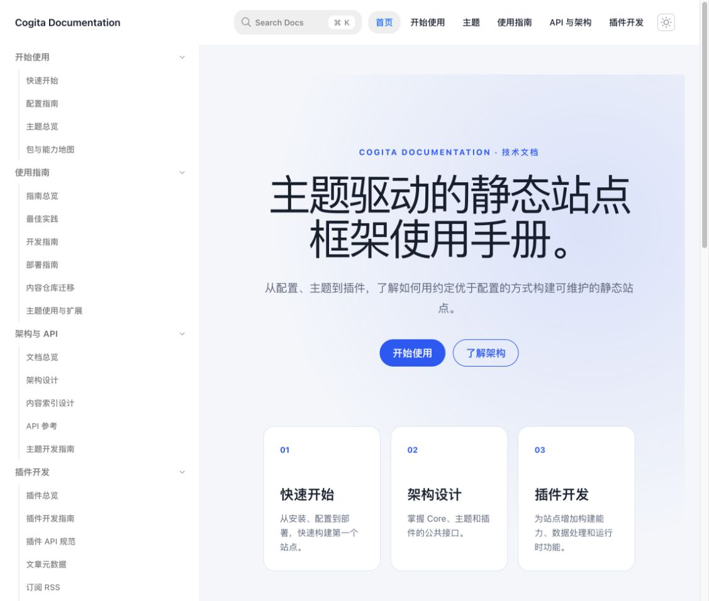
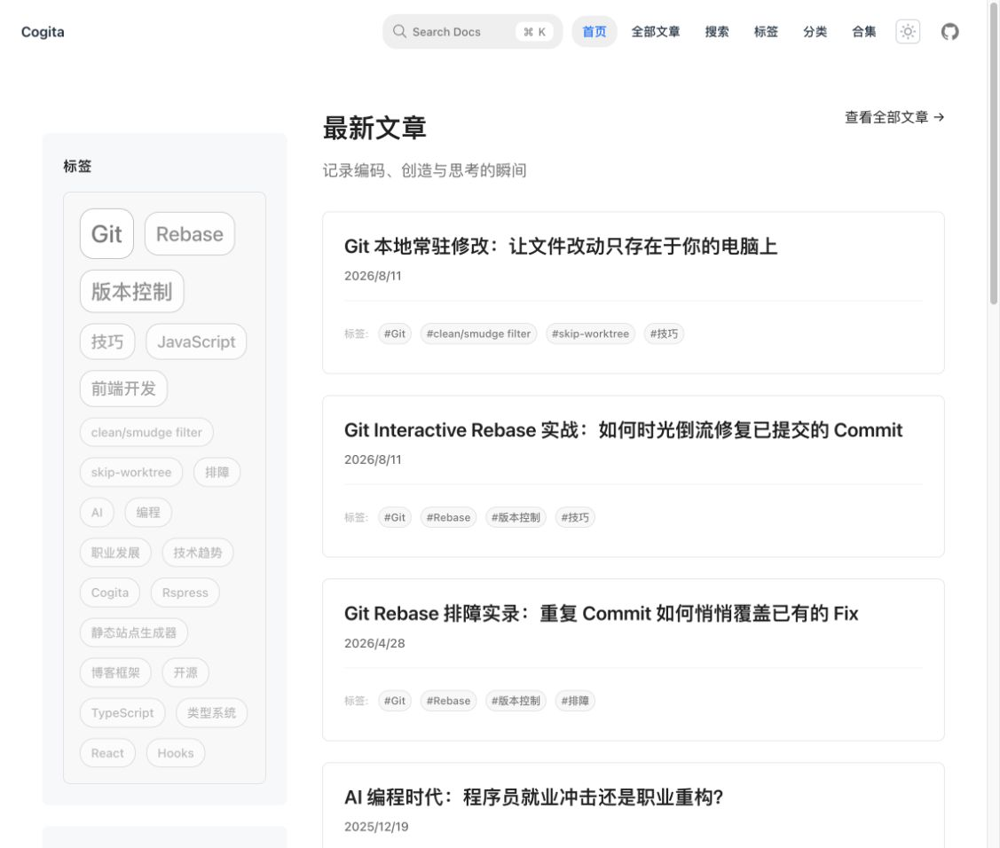
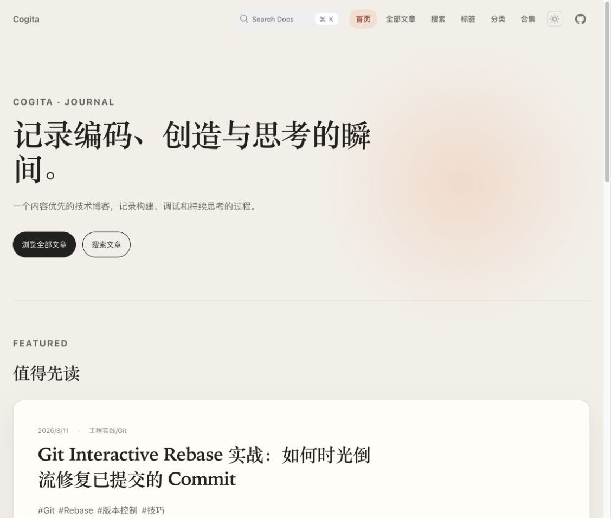

# 主题总览

Cogita 的主题不是单纯的颜色和字体。主题包负责页面布局、视觉系统以及一组默认插件能力；站点只需要选择主题并传入内容与导航配置，就可以得到适合自己场景的静态站点。

## 目前提供的主题

| 主题 | 适合场景 | 页面重点 | 安装包 |
| --- | --- | --- | --- |
| **Docs** | 项目手册、API 文档、知识库 | 目录导航、代码阅读、页面检索 | `@cogita/theme-docs` |
| **Lucid** | 个人博客、技术文章、内容归档 | 文章列表、标签、搜索、阅读体验 | `@cogita/theme-lucid` |
| **Editorial** | 专题站点、深度文章、编辑型内容 | 大标题、精选内容、杂志式节奏 | `@cogita/theme-editorial` |
| **Knowledge** | 个人 Wiki、研究记录、混合知识库 | 统一内容、搜索、标签、反向链接 | `@cogita/theme-knowledge` |

下面介绍当前提供的四个主题。它们共享 Cogita 的 Core、插件和内容索引，但在信息架构和阅读节奏上做了不同取舍。仓库的 [`demos/`](https://github.com/wu9o/cogita/tree/main/demos) 目录为每个主题提供了独立的站点消费者和自定义示例内容；执行 `pnpm run demo` 即可在本地打开主题总览。

## 主题 Demo

每个主题都有独立的构建产物，可以直接查看真实页面和接入配置：[打开主题 Demo 总览](https://wu9o.github.io/cogita/demos/)。

## Docs：技术文档主题



Docs 面向“查阅和理解”。它提供左侧章节导航、正文阅读区和页面目录，适合安装指南、架构说明、API 参考和插件开发文档。截图来自当前 `docs-site` 的首页构建结果。

```bash
pnpm add -D @cogita/cli @cogita/core @cogita/theme-docs
```

```ts
export default defineConfig({
  contentDir: 'content',
  theme: '@cogita/theme-docs',
});
```

## Lucid：内容型博客主题



Lucid 面向“持续发布和浏览”。它更强调文章列表、标签、分类、搜索、阅读进度和订阅入口，适合个人博客与技术写作。上图使用 8 篇示例文章执行 `cogita build` 后，再通过本地预览服务器打开首页得到；因此它反映的是当前 Lucid 包的实际布局，而不是设计稿。

```bash
pnpm add -D @cogita/cli @cogita/core @cogita/theme-lucid
```

```ts
export default defineConfig({
  posts: { dir: 'posts', routePrefix: 'posts' },
  theme: '@cogita/theme-lucid',
});
```

## Editorial：编辑感主题



Editorial 面向“专题和叙事”。它使用更强的标题层级、精选文章和卡片节奏，适合项目故事、研究记录、专题文章以及需要突出观点的内容站点。截图使用 8 篇示例文章构建得到。

```bash
pnpm add -D @cogita/cli @cogita/core @cogita/theme-editorial
```

```ts
export default defineConfig({
  posts: { dir: 'posts', routePrefix: 'posts' },
  theme: '@cogita/theme-editorial',
});
```

## Knowledge：知识库主题

Knowledge 面向“连接和回溯”。它把 `posts` 与 `contentDir` 纳入统一内容入口，并默认组合本地搜索、标签和内容关系，适合个人 Wiki、技术研究记录以及同时包含文章和手册的长期知识库。

```bash
pnpm add -D @cogita/cli @cogita/core @cogita/theme-knowledge
```

```ts
export default defineConfig({
  contentDir: 'content',
  theme: '@cogita/theme-knowledge',
});
```

## 如何选择

- 读者主要通过目录、代码和 API 查找信息：选择 **Docs**。
- 站点以持续写文章、归档和搜索为主：选择 **Lucid**。
- 站点以专题、深度文章和编辑节奏为主：选择 **Editorial**。
- 站点需要把文章、文档和反向链接放在同一知识空间中：选择 **Knowledge**。

主题之间可以共享同一套文章内容和插件。迁移主题时，通常只需要修改 `theme` 和主题专属配置，不需要迁移文章文件。

## 主题与插件的边界

主题负责展示，插件负责数据和构建能力。例如，文章扫描由 Posts Frontmatter 插件完成，主题只消费文章索引并决定如何展示；评论、搜索、阅读进度等能力也遵循同样的边界。

如果现有主题不能满足页面结构，可以参考[主题使用与扩展](./theme-customization.md)；如果要创建一个可复用的新主题，请阅读[主题开发指南](./theme-development.md)。
