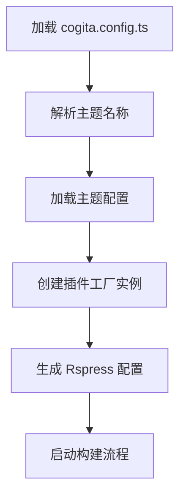
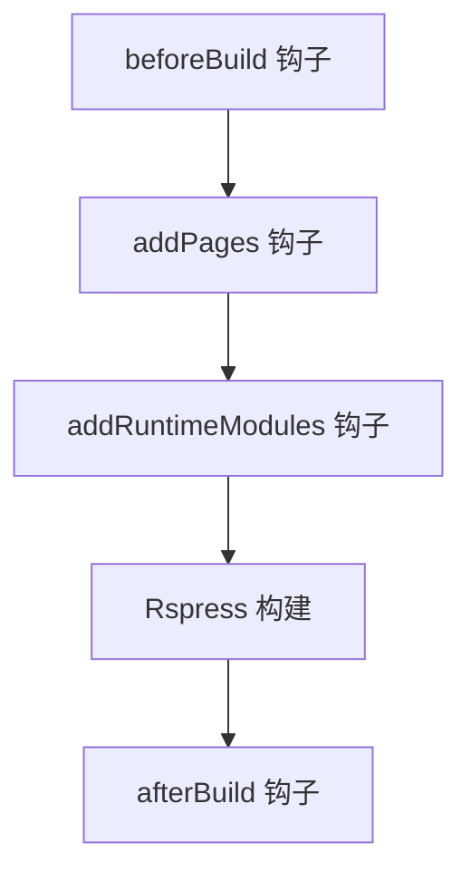

# API 参考文档

本文档详细描述了 Cogita 框架的所有公共 API 接口。

## 📋 目录

- [核心 API](#-核心-api)
- [配置接口](#-配置接口)
- [主题接口](#-主题接口)
- [插件接口](#-插件接口)
- [共享类型](#-共享类型)
- [工具函数](#-工具函数)

## 🔧 核心 API

### `@cogita/core`

#### `defineConfig(config: CogitaConfig): CogitaConfig`

定义 Cogita 配置的类型安全函数。

**参数：**
- `config`: 完整的 Cogita 配置对象

**返回：**
- 相同的配置对象，用于类型检查和 IDE 支持

**示例：**
```typescript
import { defineConfig } from '@cogita/core';

export default defineConfig({
  site: {
    title: 'My Blog',
    description: 'A personal blog',
  },
  theme: 'lucid',
});
```

#### `loadCogitaConfig(root?: string): Promise<CogitaConfig>`

异步加载 Cogita 配置文件。

**参数：**
- `root` (可选): 项目根目录，默认为 `process.cwd()`

**返回：**
- `Promise<CogitaConfig>`: 解析后的配置对象

**查找顺序：**
1. `cogita.config.ts`
2. `cogita.config.js`
3. `cogita.config.mjs`

**示例：**
```typescript
import { loadCogitaConfig } from '@cogita/core';

const config = await loadCogitaConfig('/path/to/project');
console.log(config.site?.title);
```

#### `createRspressConfig(cogitaConfig: CogitaConfig, root: string): Promise<UserConfig>`

将 Cogita 配置转换为 Rspress 配置。

**参数：**
- `cogitaConfig`: Cogita 配置对象
- `root`: 项目根目录

**返回：**
- `Promise<UserConfig>`: Rspress 配置对象

**内部流程：**
1. 解析主题配置
2. 加载主题声明的插件
3. 创建主题插件
4. 合并所有配置

## ⚙️ 配置接口

### `CogitaConfig`

主要的配置接口。

```typescript
interface CogitaConfig {
  site?: SiteConfig;
  theme?: string;
  themeConfig?: ThemeConfig;
  builderConfig?: BuilderConfig;
}
```

#### `SiteConfig`

网站基础配置。

```typescript
interface SiteConfig {
  /** 网站标题 */
  title?: string;
  /** 网站描述 */
  description?: string;
  /** 网站基础路径，部署到子路径时使用 */
  base?: string;
}
```

**示例：**
```typescript
const siteConfig: SiteConfig = {
  title: 'Cogita Blog',
  description: '基于 Cogita 构建的博客',
  base: '/blog/',  // 部署到 example.com/blog/
};
```

#### `ThemeConfig`

直接透传给 Rspress 的主题配置。参考 [Rspress 主题配置](https://rspress.dev/api/config/config-theme)。

```typescript
type ThemeConfig = UserConfig['themeConfig'];
```

**常用配置：**
```typescript
const themeConfig: ThemeConfig = {
  socialLinks: [
    {
      icon: 'github',
      mode: 'link',
      content: 'https://github.com/username',
    },
    {
      icon: 'x',
      mode: 'link', 
      content: 'https://x.com/username',
    },
  ],
  footer: {
    message: '© 2024 My Blog. All rights reserved.',
  },
};
```

#### `BuilderConfig`

直接透传给 Rspress 的构建配置。参考 [Rspress 构建配置](https://rspress.dev/api/config/config-builder)。

```typescript
type BuilderConfig = UserConfig['builderConfig'];
```

**常用配置：**
```typescript
const builderConfig: BuilderConfig = {
  output: {
    assetPrefix: '/static/',
    distPath: {
      root: 'build',
    },
  },
  html: {
    tags: [
      {
        tag: 'meta',
        attrs: { name: 'author', content: 'Your Name' },
      },
    ],
  },
};
```

## 🎨 主题接口

### `@cogita/shared`

#### `CogitaTheme`

主题定义接口。

```typescript
interface CogitaTheme {
  /** 主题名称，通常是 npm 包名 */
  name: string;
  /** 页面布局组件路径 */
  pageLayouts: {
    home: string;  // 首页布局组件路径
  };
  /** 全局样式文件路径数组 */
  globalStyles?: string[];
  /** 插件工厂函数数组 */
  plugins?: CogitaPluginFactory[];
}
```

**示例：**
```typescript
export function getThemeConfig(): CogitaTheme {
  return {
    name: '@cogita/theme-lucid',
    pageLayouts: {
      home: './layouts/Home.js',
    },
    globalStyles: [
      path.resolve(__dirname, './theme.css'),
    ],
    plugins: [
      pluginPostsFrontmatter,
      pluginTags,
    ],
  };
}
```

#### `LayoutProps`

布局组件的 Props 接口。

```typescript
interface LayoutProps {
  /** 当前路由路径 */
  routePath: string;
  /** Rspress 配置对象 */
  config: UserConfig;
  /** 页面数据 */
  pageData: Record<string, any>;
  /** 子组件 */
  children?: React.ReactNode;
}
```

**示例：**
```typescript
import type { LayoutProps } from '@cogita/shared';
import { PostList } from '@cogita/ui';

const HomeLayout: React.FC<LayoutProps> = ({ routePath, config, pageData }) => {
  return (
    <div>
      <header>
        <h1>{config.title}</h1>
      </header>
      <main>
        <PostList posts={allPosts} />
      </main>
    </div>
  );
};
```

## 🔌 插件接口

### `CogitaPluginFactory`

插件工厂函数类型。

```typescript
type CogitaPluginFactory = (
  config: Record<string, any>
) => RspressPlugin | RspressPlugin[] | null | undefined;
```

**参数：**
- `config`: 完整的配置对象，包含 Cogita 配置和 Rspress 配置

**返回值：**
- `RspressPlugin`: 单个插件实例
- `RspressPlugin[]`: 插件数组
- `null | undefined`: 禁用插件

**示例：**
```typescript
export const pluginExample: CogitaPluginFactory = (config) => {
  // 从配置中提取插件选项
  const options = config.example || {};
  
  // 条件性禁用插件
  if (!options.enabled) {
    return null;
  }
  
  return {
    name: '@cogita/plugin-example',
    async beforeBuild() {
      console.log('Example plugin: preparing build');
    },
  };
};
```

### Rspress 插件接口

基于 Rspress 的插件接口，包含以下生命周期钩子：

```typescript
interface RspressPlugin {
  /** 插件名称 */
  name: string;
  
  /** 构建前钩子 */
  beforeBuild?: () => void | Promise<void>;
  
  /** 构建后钩子 */
  afterBuild?: () => void | Promise<void>;
  
  /** 动态添加页面 */
  addPages?: () => AdditionalPage[] | Promise<AdditionalPage[]>;
  
  /** 添加运行时模块 */
  addRuntimeModules?: () => Record<string, string>;
  
  /** 配置修改钩子 */
  config?: (config: UserConfig) => UserConfig | void;
  
  /** 更多钩子... */
}
```

#### `AdditionalPage`

动态页面配置。

```typescript
interface AdditionalPage {
  /** 路由路径 */
  routePath: string;
  /** 页面内容，通常包含 frontmatter */
  content: string;
  /** 组件文件路径 */
  filepath: string;
}
```

**示例：**
```typescript
addPages() {
  return [
    {
      routePath: '/archive',
      content: '---npageType: archiven---',
      filepath: path.resolve(__dirname, './components/Archive.tsx'),
    },
  ];
}
```

## 📊 共享类型

### `@cogita/ui`

#### `Post`

文章数据接口。

```typescript
interface Post {
  /** 文章标题 */
  title: string;
  /** 文章描述 */
  description?: string;
  /** 文件路径 */
  filePath: string;
  /** 路由路径 */
  route: string;
  /** 完整 URL */
  url: string;
  /** 创建日期 */
  createDate: string;
  /** 更新日期 */
  updateDate: string;
  /** 分类 */
  categories?: string[];
  /** 标签 */
  tags?: string[];
}
```

#### `PostListProps`

文章列表组件 Props。

```typescript
interface PostListProps {
  /** 文章数组 */
  posts: Post[];
  /** 自定义渲染函数 */
  renderItem?: (post: Post) => React.ReactNode;
}
```

**使用示例：**
```typescript
import { PostList } from '@cogita/ui';
import type { Post } from '@cogita/ui';

const MyPostList: React.FC = () => {
  const posts: Post[] = allPosts;
  
  return (
    <PostList
      posts={posts}
      renderItem={(post) => (
        <div key={post.url}>
          <h3>{post.title}</h3>
          <p>{post.description}</p>
          <time>{post.createDate}</time>
        </div>
      )}
    />
  );
};
```

### 插件特定类型

#### `PostFrontmatter` (`@cogita/plugin-posts-frontmatter`)

文章 frontmatter 数据结构。

```typescript
interface PostFrontmatter {
  /** 文章标题 */
  title: string;
  /** 文章描述 */
  description?: string;
  /** 文件绝对路径 */
  filePath: string;
  /** 路由路径 */
  route: string;
  /** URL（兼容字段） */
  url: string;
  /** 创建日期（ISO 字符串） */
  createDate: string;
  /** 更新日期（ISO 字符串） */
  updateDate: string;
  /** 分类数组 */
  categories?: string[];
  /** 标签数组 */
  tags?: string[];
}
```

## 🛠️ 工具函数

### `@cogita/plugin-posts-frontmatter/utils`

#### `getFrontmatterFromFile(filePath, postsDir, routePrefix): PostFrontmatter | null`

从文件中提取 frontmatter 数据。

**参数：**
- `filePath: string` - 文件绝对路径
- `postsDir: string` - 文章目录路径
- `routePrefix: string` - 路由前缀，默认 `'posts'`

**返回：**
- `PostFrontmatter | null` - 解析成功返回数据对象，失败返回 null

**示例：**
```typescript
import { getFrontmatterFromFile } from '@cogita/plugin-posts-frontmatter/utils';

const postData = getFrontmatterFromFile(
  '/path/to/posts/my-post.md',
  '/path/to/posts',
  'blog'
);

console.log(postData?.title); // 文章标题
console.log(postData?.route); // /blog/my-post
```

**内部处理：**
1. 检查文件扩展名（.md, .mdx）
2. 读取文件内容和文件系统统计信息
3. 使用 `gray-matter` 解析 frontmatter
4. 生成路由路径（去除扩展名，处理 index 文件）
5. 合并 frontmatter 数据与文件统计信息

## 🌐 虚拟模块

Cogita 通过虚拟模块向前端代码提供数据。

### `virtual-posts-data`

由 `@cogita/plugin-posts-frontmatter` 提供的虚拟模块。

```typescript
declare module 'virtual-posts-data' {
  export const allPosts: PostFrontmatter[];
}
```

**使用示例：**
```typescript
import { allPosts } from 'virtual-posts-data';

// 在组件中使用
const RecentPosts: React.FC = () => {
  const recentPosts = allPosts.slice(0, 5);
  
  return (
    <div>
      {recentPosts.map(post => (
        <div key={post.url}>
          <h3>{post.title}</h3>
          <time>{post.createDate}</time>
        </div>
      ))}
    </div>
  );
};
```

## 🔄 生命周期流程

### 配置加载流程



### 插件执行流程



## 📝 类型声明文件

### 客户端类型声明

为虚拟模块提供类型支持，在插件根目录创建 `client.d.ts`：

```typescript
// client.d.ts
declare module 'virtual-posts-data' {
  import type { PostFrontmatter } from './src/types';
  export const allPosts: PostFrontmatter[];
}
```

### TypeScript 配置

确保你的项目包含必要的类型声明：

```json
{
  "compilerOptions": {
    "moduleResolution": "node",
    "esModuleInterop": true,
    "allowSyntheticDefaultImports": true
  },
  "include": [
    "src/**/*",
    "client.d.ts"
  ]
}
```

## 🚨 错误处理

### 常见错误类型

#### 配置错误

```typescript
// 主题加载失败
Error: Theme '@cogita/theme-nonexistent' does not export a 'getThemeConfig' function.

// 配置文件格式错误
Error: Failed to load config file: /path/to/cogita.config.ts
```

#### 插件错误

```typescript
// 插件执行错误
Error: Plugin @cogita/plugin-example error: Cannot read property 'enabled' of undefined
```

### 错误处理最佳实践

```typescript
export const pluginExample: CogitaPluginFactory = (config) => {
  try {
    const options = config.example || {};
    
    // 参数验证
    if (typeof options.enabled !== 'boolean') {
      throw new Error('options.enabled must be a boolean');
    }
    
    return createExamplePlugin(options);
  } catch (error) {
    console.error(`Plugin example configuration error: ${error.message}`);
    
    // 提供有用的错误信息
    console.error('提示：请检查 cogita.config.ts 中的 example 配置');
    
    // 可以选择返回 null 禁用插件，或者抛出错误
    return null;
  }
};
```

## 📚 更多资源

- [Rspress API 文档](https://rspress.dev/api/)
- [插件开发指南](./plugin-development.md)
- [主题开发指南](./theme-development.md) *(即将推出)*
- [最佳实践指南](./best-practices.md) *(即将推出)*

---

这份 API 参考文档涵盖了 Cogita 框架的所有公共接口。如果你发现遗漏或有任何疑问，欢迎提交 Issue 或 PR！
