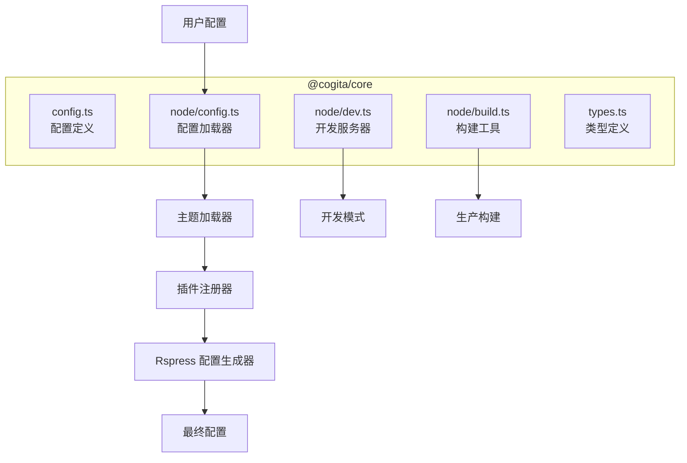
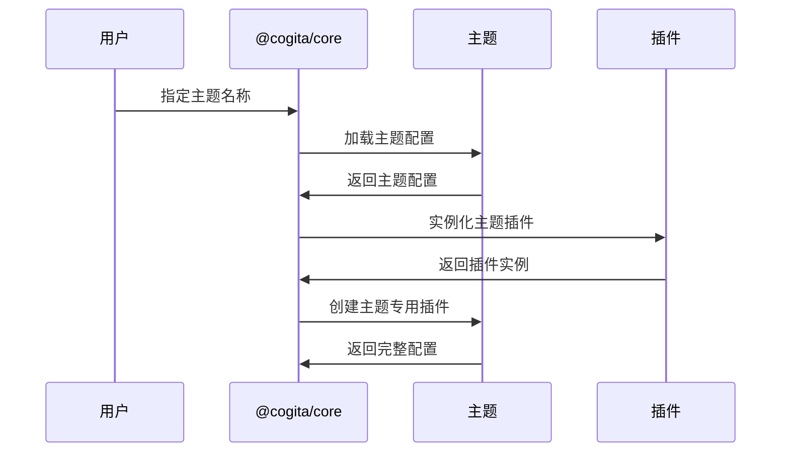
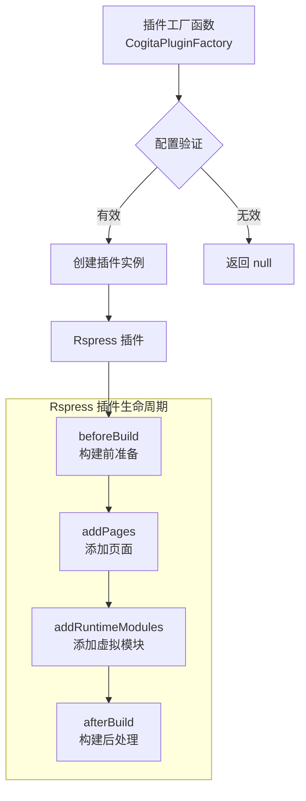
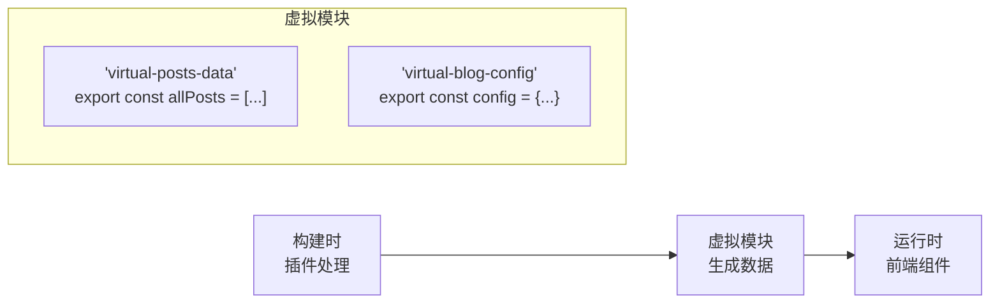
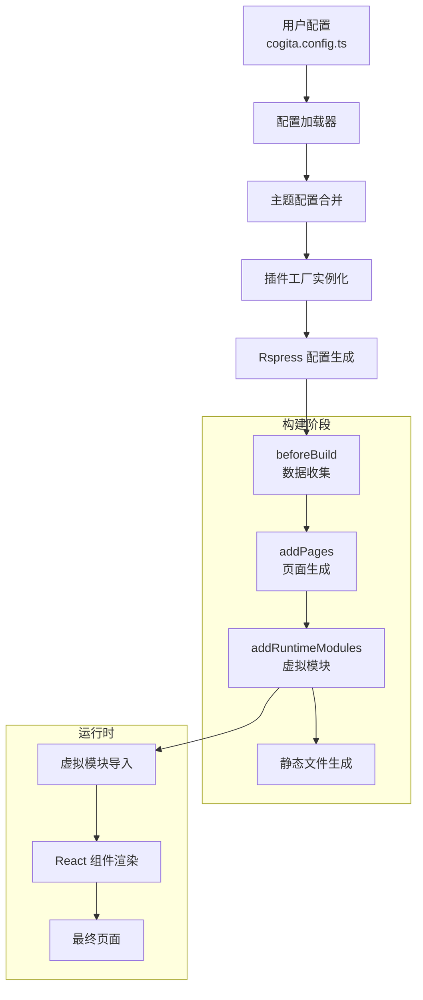
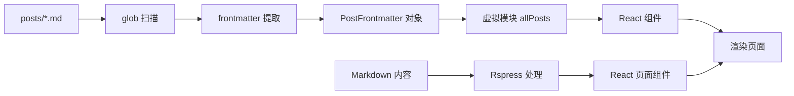
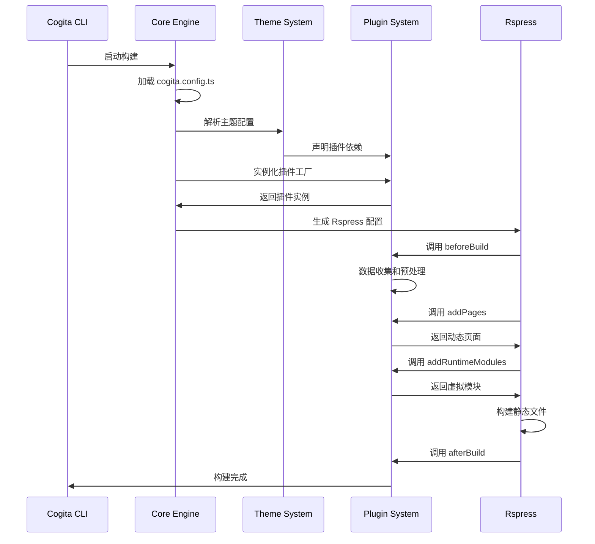

# 架构设计文档

本文档详细阐述了 Cogita 框架的系统架构、设计理念和技术实现细节。

## 📋 目录

- [设计原则](#-设计原则)
- [整体架构](#-整体架构)
- [核心模块设计](#-核心模块设计)
- [主题系统](#-主题系统)
- [插件系统](#-插件系统)
- [数据流向](#-数据流向)
- [构建流程](#-构建流程)
- [扩展机制](#-扩展机制)

## 🎯 设计原则

### 1. 约定优于配置 (Convention over Configuration)

Cogita 遵循"约定优于配置"的设计哲学，通过合理的默认值和标准化的目录结构，最大化减少用户的配置负担。

**核心约定：**
- 文章存放在 `posts/` 目录
- 配置文件命名为 `cogita.config.ts`
- 主题自动加载所需插件
- 路由基于文件系统生成

### 2. 主题驱动架构 (Theme-Driven Architecture)

**传统方式：**
```
用户 → 选择主题 → 手动安装插件 → 手动配置
```

**Cogita 方式：**
```
用户 → 选择主题 → 主题自动声明依赖 → 核心自动加载
```

这种设计让主题成为完整的生态系统，而不仅仅是视觉样式。

### 3. 渐进增强 (Progressive Enhancement)

- **基础级别**：零配置启动，基本功能可用
- **进阶级别**：通过配置启用更多功能
- **专家级别**：完全访问底层 Rspress 能力

### 4. 类型安全优先 (Type-First)

所有公共 API 都有完整的 TypeScript 类型定义，确保开发时的类型安全和 IDE 支持。

## 🏗️ 整体架构

```mermaid
graph TB
    subgraph "用户层"
        A[cogita.config.ts]
        B[posts/ 目录]
        C[自定义组件]
    end
    
    subgraph "框架层"
        D[@cogita/core<br/>核心引擎]
        E[@cogita/cli<br/>命令行工具]
    end
    
    subgraph "主题层"
        F[@cogita/theme-lucid<br/>默认主题]
        G[社区主题]
    end
    
    subgraph "插件层"
        H[posts-frontmatter<br/>文章处理]
        I[tags<br/>标签系统]
        J[rss<br/>RSS 订阅]
    end
    
    subgraph "UI 层"
        K[@cogita/ui<br/>通用组件]
        L[@cogita/shared<br/>共享类型]
    end
    
    subgraph "基础层"
        M[Rspress<br/>静态站点生成器]
        N[React<br/>UI 框架]
    end
    
    A --> D
    B --> H
    D --> F
    D --> G
    F --> H
    F --> I
    G --> J
    F --> K
    K --> L
    E --> D
    D --> M
    M --> N
```

### 架构层次

1. **用户层**：用户提供的内容和配置
2. **框架层**：Cogita 核心功能和 CLI 工具
3. **主题层**：主题和布局组件
4. **插件层**：功能扩展插件
5. **UI 层**：可复用的 UI 组件和类型定义
6. **基础层**：底层技术栈

## 🧩 核心模块设计

### `@cogita/core` 架构



### 配置加载机制

```typescript
// 配置加载流程
export async function loadCogitaConfig(root: string): Promise<CogitaConfig> {
  // 1. 查找配置文件
  const configPath = await findUp(CONFIG_FILES, { cwd: root });
  
  if (!configPath) {
    return {}; // 使用默认配置
  }
  
  // 2. 动态加载配置文件
  const _require = jiti(fileURLToPath(import.meta.url));
  const mod = _require(configPath);
  
  // 3. 返回配置对象
  return mod.default || {};
}
```

### 主题解析机制

```typescript
async function loadTheme(themeName: string): Promise<CogitaTheme> {
  // 1. 解析主题包路径
  const packageRoot = await getPackageRoot();
  const url = await mlly.resolve(themeName, { url: packageRoot });
  
  // 2. 动态导入主题模块
  const _require = jiti(fileURLToPath(import.meta.url));
  const mod = _require(fileURLToPath(url));
  
  // 3. 验证主题接口
  if (typeof mod.getThemeConfig !== 'function') {
    throw new Error(`Theme '${themeName}' invalid interface`);
  }
  
  // 4. 获取主题配置
  return mod.getThemeConfig();
}
```

## 🎨 主题系统

### 主题生命周期



### 主题配置结构

```typescript
interface CogitaTheme {
  name: string;           // 主题包名
  pageLayouts: {          // 页面布局配置
    home: string;         // 首页布局组件路径
  };
  globalStyles?: string[]; // 全局样式文件
  plugins?: CogitaPluginFactory[]; // 依赖的插件工厂
}
```

### 主题插件自动生成

```typescript
function createThemePlugin(theme: CogitaTheme): RspressPlugin {
  return {
    name: 'cogita-theme-plugin',
    addPages: async () => {
      if (!theme.pageLayouts.home) {
        return [];
      }
      
      // 解析主题首页布局路径
      const themeDir = path.dirname(await resolveThemePath(theme.name));
      const homeLayoutPath = path.resolve(themeDir, theme.pageLayouts.home);
      
      // 添加首页路由
      return [{
        routePath: '',
        content: '---npageType: homen---',
        filepath: homeLayoutPath,
      }];
    },
  };
}
```

### 布局组件设计

主题的布局组件接收标准化的 Props：

```typescript
interface LayoutProps {
  routePath: string;              // 当前路由
  config: UserConfig;             // Rspress 配置
  pageData: Record<string, any>;  // 页面数据
  children?: React.ReactNode;     // 子组件
}
```

布局组件示例：
```typescript
const HomeLayout: React.FC<LayoutProps> = ({ config }) => {
  return (
    <div className="theme-container">
      <header>
        <h1>{config.title}</h1>
      </header>
      <main>
        <PostList posts={allPosts} />
      </main>
    </div>
  );
};
```

## 🔌 插件系统

### 插件架构设计



### 插件工厂模式

插件工厂函数的设计优势：

1. **延迟实例化**：只在需要时创建插件实例
2. **配置注入**：可以访问完整的配置上下文
3. **条件启用**：根据配置条件性地启用插件
4. **批量创建**：一个工厂可以返回多个相关插件

```typescript
export const pluginBlogSystem: CogitaPluginFactory = (config) => {
  const blogConfig = config.blog || {};
  const plugins: RspressPlugin[] = [];
  
  // 始终添加基础文章插件
  plugins.push(pluginPosts(config));
  
  // 条件性添加其他插件
  if (blogConfig.enableTags) {
    plugins.push(pluginTags(config));
  }
  
  if (blogConfig.enableRss) {
    plugins.push(pluginRss(config));
  }
  
  return plugins;
};
```

### 虚拟模块系统

Cogita 通过虚拟模块在构建时和运行时之间传递数据：



虚拟模块生成示例：
```typescript
addRuntimeModules() {
  return {
    'virtual-posts-data': `
      export const allPosts = ${JSON.stringify(allPostsData)};
      export const postsByTag = ${JSON.stringify(postsByTag)};
      
      export function getPostBySlug(slug) {
        return allPosts.find(post => post.slug === slug);
      }
    `,
  };
}
```

### 插件通信机制

插件间可以通过配置对象和虚拟模块进行通信：

```typescript
// 插件 A 生成数据
export const pluginA: CogitaPluginFactory = (config) => {
  return {
    name: 'plugin-a',
    addRuntimeModules() {
      return {
        'virtual-plugin-a-data': `export const dataA = ${JSON.stringify(data)};`,
      };
    },
  };
};

// 插件 B 消费数据
export const pluginB: CogitaPluginFactory = (config) => {
  return {
    name: 'plugin-b',
    addRuntimeModules() {
      return {
        'virtual-plugin-b-enhanced': `
          import { dataA } from 'virtual-plugin-a-data';
          export const enhancedData = processData(dataA);
        `,
      };
    },
  };
};
```

## 📊 数据流向

### 配置到构建的数据流



### 文件系统到页面的转换



### 数据处理管道

```typescript
// 数据处理流水线
const dataProcessingPipeline = [
  // 1. 数据收集阶段
  async (config) => {
    const files = await glob(`${config.postsDir}/**/*.{md,mdx}`);
    return files;
  },
  
  // 2. 数据解析阶段
  (files) => {
    return files.map(file => getFrontmatterFromFile(file));
  },
  
  // 3. 数据转换阶段
  (rawData) => {
    return rawData.filter(Boolean).sort((a, b) => 
      new Date(b.createDate).getTime() - new Date(a.createDate).getTime()
    );
  },
  
  // 4. 数据序列化阶段
  (processedData) => {
    return JSON.stringify(processedData);
  },
];
```

## ⚙️ 构建流程

### 完整构建流程



### 开发模式流程

```typescript
// 开发服务器启动流程
export async function dev(options: DevOptions) {
  // 1. 加载配置
  const cogitaConfig = await loadCogitaConfig(options.root);
  
  // 2. 生成 Rspress 配置
  const rspressConfig = await createRspressConfig(cogitaConfig, options.root);
  
  // 3. 启动开发服务器
  const { createDevServer } = await import('@rspress/core');
  const server = await createDevServer({
    config: rspressConfig,
    ...options,
  });
  
  // 4. 监听文件变化
  server.listen();
}
```

### 生产构建流程

```typescript
// 生产构建流程
export async function build(options: BuildOptions) {
  // 1. 加载和验证配置
  const cogitaConfig = await loadCogitaConfig(options.root);
  const rspressConfig = await createRspressConfig(cogitaConfig, options.root);
  
  // 2. 执行构建
  const { build } = await import('@rspress/core');
  await build({
    config: rspressConfig,
    ...options,
  });
  
  // 3. 后处理（如果需要）
  await postBuildOptimizations(rspressConfig);
}
```

## 🔧 扩展机制

### 插件扩展点

Cogita 通过 Rspress 的插件系统提供了多个扩展点：

```typescript
interface ExtensionPoints {
  // 配置阶段
  modifyConfig?: (config: UserConfig) => UserConfig;
  
  // 构建阶段
  beforeBuild?: () => void | Promise<void>;
  afterBuild?: () => void | Promise<void>;
  
  // 页面生成
  addPages?: () => AdditionalPage[];
  addRoutes?: () => Route[];
  
  // 运行时
  addRuntimeModules?: () => Record<string, string>;
  addGlobalComponents?: () => Record<string, string>;
  
  // 开发阶段
  onDevServerStart?: (server: DevServer) => void;
  onFileChange?: (filePath: string) => void;
}
```

### 主题扩展模式

主题可以通过多种方式扩展功能：

1. **插件依赖**：声明必需的插件
2. **可选插件**：根据配置条件性加载插件
3. **自定义组件**：提供可覆盖的组件
4. **样式扩展**：支持样式自定义

```typescript
// 主题扩展示例
export function getThemeConfig(): CogitaTheme {
  return {
    name: '@cogita/theme-advanced',
    pageLayouts: {
      home: './layouts/Home.js',
    },
    plugins: [
      // 必需插件
      pluginPostsFrontmatter,
      
      // 条件插件工厂
      (config) => {
        const plugins = [];
        
        if (config.theme?.enableSearch) {
          plugins.push(pluginSearch(config));
        }
        
        if (config.theme?.enableComments) {
          plugins.push(pluginComments(config));
        }
        
        return plugins;
      },
    ],
  };
}
```

### 组件覆盖机制

用户可以通过配置覆盖主题提供的组件：

```typescript
// 在 cogita.config.ts 中
export default defineConfig({
  theme: 'lucid',
  themeConfig: {
    // 覆盖默认组件
    components: {
      PostList: './components/MyCustomPostList.tsx',
      Header: './components/MyCustomHeader.tsx',
    },
  },
});
```

## 🚀 性能优化

### 构建性能优化

1. **增量构建**：只重新处理变更的文件
2. **并行处理**：使用 Worker 线程并行处理文件
3. **智能缓存**：缓存昂贵的计算结果
4. **按需加载**：只加载必要的插件和主题

```typescript
// 缓存机制示例
class BuildCache {
  private cache = new Map<string, any>();
  
  async getOrCompute<T>(
    key: string, 
    computeFn: () => Promise<T>
  ): Promise<T> {
    if (this.cache.has(key)) {
      return this.cache.get(key);
    }
    
    const result = await computeFn();
    this.cache.set(key, result);
    return result;
  }
}
```

### 运行时性能优化

1. **代码分割**：按路由分割代码包
2. **懒加载**：延迟加载非关键组件
3. **Tree Shaking**：移除未使用的代码
4. **资源优化**：压缩和优化静态资源

## 🔮 未来架构演进

### 计划中的架构改进

1. **微前端支持**：支持多个独立的博客模块
2. **服务端渲染**：可选的 SSR 支持
3. **边缘计算**：在边缘节点上运行部分逻辑
4. **WebAssembly 插件**：支持 WASM 插件以提高性能

### 扩展性考虑

当前架构设计考虑了未来的扩展需求：

- **模块化设计**：核心功能拆分为独立模块
- **标准化接口**：定义清晰的插件和主题接口
- **配置抽象**：配置层与实现层分离
- **类型安全**：完整的 TypeScript 支持

---

这份架构设计文档展示了 Cogita 框架的内部工作原理和设计决策。理解这些架构细节有助于开发者更好地使用和扩展 Cogita。
